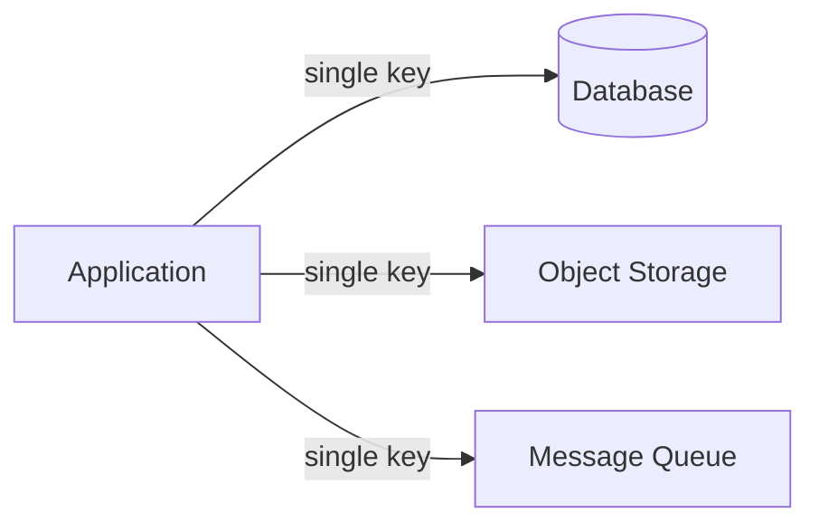

import AsciiDiagram from '@site/src/components/AsciiDiagram';

# Encryption at Scale

You are designing a system that stores sensitive user data — passwords, payment
details, personal messages, medical records. You know you need encryption. But
slapping a single key on the database and calling it done will fail the moment
your system grows past one server, one region, or one compliance audit.

This page walks you through encryption at scale: what breaks, what replaces it,
and how to design a production-grade encryption architecture that spans
databases, storage, message queues, and multiple cloud regions.

---

## Why a Single Key Fails

The simplest possible design is one encryption key that every service shares.
You encrypt everything with AES-256 using a single key stored in a config file
or an environment variable.



This works for a prototype. Then reality hits.

**Key compromise is total disaster.** If an attacker obtains that one key, they
decrypt every piece of data you have — past, present, and future. There is no
compartmentalization, no blast radius. A single `git push` that accidentally
exposes your `.env` file and your entire encryption posture collapses.

**Rotation is impossible at scale.** To rotate the key, you must re-encrypt
every byte of data in every storage system. For a system holding terabytes or
petabytes, this means days of downtime, massive compute cost, and complex
coordination to ensure no data is left in the old key. Most teams simply never
rotate, which violates every compliance framework (PCI-DSS, SOC 2, HIPAA).

**No access control.** Every service, every developer, every CI pipeline that
has access to the key can encrypt and decrypt anything. You cannot audit who
decrypted what, when, or why. You cannot grant a service read-only access to
specific columns. You cannot revoke one team's access without rotating the key
for everyone.

**Scaling bottleneck.** A single key means a single point of cryptographic
contention. Every encrypt and decrypt operation serializes through that one
key. Your KMS or HSM can handle millions of requests per second, but your
architecture cannot — it is limited by the throughput of whatever process
manages that one key.

<AsciiDiagram
  id="encryption/single-key-failure"
  alt="Diagram showing a single key shared across all services and storage systems, with failure modes highlighted"
  caption="Single-key architecture and its failure modes"
  title="Single-Key Failure Modes"

content={`┌─────────────────────────────────────────────────────────────┐
│                   SINGLE-KEY ARCHITECTURE                       │
│                                                                 │
│                     ┌───────────────┐                           │
│                     │   ONE KEY     │                           │
│                     │  shared.env   │                           │
│                     └───────┬───────┘                           │
│                             │                                    │
│       ┌─────────────────────┼─────────────────────┐              │
│       │                     │                     │              │
│       ▼                     ▼                     ▼              │
│ ┌──────────┐          ┌──────────┐          ┌──────────┐        │
│ │ Database │          │ Storage  │          │   Queue  │        │
│ │   AES    │          │   AES    │          │   AES    │        │
│ └──────────┘          └──────────┘          └──────────┘        │
│                                                                 │
│  ┌── Failure Modes ──────────────────────────────────────┐     │
│  │ 1. Key leak → all data compromised                   │     │
│  │ 2. Key rotation → re-encrypt everything (offline)    │     │
│  │ 3. No audit → who decrypted what? unknown            │     │
│  │ 4. No granularity → one permission for all           │     │
│  └──────────────────────────────────────────────────────┘     │
└─────────────────────────────────────────────────────────────┘`} />

The takeaway is clear: a single key is a single point of failure for your
entire security posture. You need a layered architecture.

---

## Production-Grade Encryption Architecture

A production encryption system has four distinct layers, each addressing a
different threat model.

<AsciiDiagram
  id="encryption/production-layers-overview"
  alt="Four-layer encryption architecture showing encryption at rest, encryption in transit, key management with KMS, and root of trust with HSM"
  caption="Four-layer production encryption architecture"
  title="Production Encryption Layers"

content={`┌─────────────────────────────────────────────────────────────────┐
│                  ENCRYPTION ARCHITECTURE LAYERS                    │
│                                                                   │
│  ┌── LAYER 4: Application-Level Encryption ──────────────────┐   │
│  │  Envelope encryption │ Column-level │ Field-level         │   │
│  │  Data encrypted before it reaches the storage layer        │   │
│  └────────────────────────────────────────────────────────────┘   │
│                              │                                    │
│                              ▼                                    │
│  ┌── LAYER 3: Transport Encryption ──────────────────────────┐   │
│  │  TLS 1.3 │ mTLS │ HSTS │ Certificate Pinning              │   │
│  │  Data encrypted in flight between services                 │   │
│  └────────────────────────────────────────────────────────────┘   │
│                              │                                    │
│                              ▼                                    │
│  ┌── LAYER 2: Storage-Level Encryption ──────────────────────┐   │
│  │  TDE (Transparent Data Encryption) │ Disk encryption       │   │
│  │  SSE (Server-Side Encryption) for S3 / Blob Storage        │   │
│  └────────────────────────────────────────────────────────────┘   │
│                              │                                    │
│                              ▼                                    │
│  ┌── LAYER 1: Key Management Infrastructure ────────────────┐   │
│  │  KMS (Key Management Service) │ HSM (Hardware Security    │   │
│  │  Module) │ Envelope Encryption │ Key Rotation             │   │
│  └────────────────────────────────────────────────────────────┘   │
└─────────────────────────────────────────────────────────────────┘`} />

### Layer 1: Key Management Infrastructure

At the foundation is your key management layer. This is not a config file or an
environment variable. It is a dedicated service — or hardware appliance — whose
sole job is to generate, store, rotate, and audit cryptographic keys.

**KMS (Key Management Service).** Cloud providers offer managed KMS:
AWS KMS, GCP Cloud KMS, Azure Key Vault. A KMS stores master keys (also called
customer master keys or CMKs) in a hardened service. No one — not even you —
ever extracts the master key material. You call `KMS.Encrypt` and `KMS.Decrypt`
API operations; the key never leaves the service boundary.

**HSM (Hardware Security Module).** For maximum security, you use an HSM — a
tamper-resistant hardware appliance that stores keys. HSMs are certified under
FIPS 140-2 Level 3 or Level 4. Cloud KMS offerings are themselves backed by
HSMs. If you operate in a regulated industry (finance, government, healthcare),
you may run your own HSM cluster on-premises or use a cloud HSM offering.

**Key hierarchy.** A key management system is itself a tree of keys. At the
root is the master key stored in the KMS or HSM. Below it are key encryption
keys (KEKs) and data encryption keys (DEKs). This hierarchy makes rotation
practical: you only need to re-wrap the lower-level keys, not re-encrypt every
byte of data.

### Layer 2: Encryption at Rest

Encryption at rest protects data when it is stored on disk. There are three
common approaches, each with different trade-offs.

**Disk-level encryption.** The storage volume itself is encrypted. On AWS this
is EBS encryption; on GCP it is persistent disk encryption. The OS and
filesystem are unaware of it. The key is managed by the hypervisor and the KMS.
This protects against physical theft of drives but does not protect against
attackers who have OS-level access.

**Database-level encryption (TDE).** Transparent Data Encryption is built into
database engines like SQL Server, Oracle, and MySQL. The database encrypts data
pages before writing them to disk and decrypts them on read. The database engine
manages a key hierarchy internally: a certificate protects the database
encryption key, which in turn protects the actual data pages. This protects
against backup theft and disk theft but not against attackers with database
login credentials.

**Application-level encryption.** You encrypt data in your application code
before it ever reaches the database or storage layer. This is the most secure
option — the storage system sees only ciphertext. It also gives you the most
control: you can encrypt different columns with different keys, support
multi-tenant isolation, and maintain customer-managed encryption keys. The
downside is complexity: you lose the ability to query encrypted fields (no
WHERE clauses on encrypted columns, no indexes, no joins).

### Layer 3: Encryption in Transit

Data is vulnerable while it moves between services. Encryption in transit
ensures that an attacker who captures network traffic cannot read the data.

**TLS 1.3 everywhere.** Every network connection — internal and external — uses
TLS 1.3. This includes connections between microservices, between the
application and the database, between the application and object storage, and
between services and the message queue. There are no exceptions.

**mTLS for service-to-service.** Mutual TLS (mTLS) adds certificate-based
authentication on both sides of the connection. Service A verifies Service B's
certificate, and Service B verifies Service A's certificate. This prevents
man-in-the-middle attacks even within your own network. Service meshes like
Istio and Linkerd automate mTLS at the infrastructure layer.

**Certificate management.** TLS requires certificates, and certificates expire.
You need automated certificate issuance and renewal. Cert-Manager on Kubernetes
or ACM (AWS Certificate Manager) handles this. Without automation, services
will go down when certificates expire — a surprisingly common production
incident.

### Layer 4: Envelope Encryption

Envelope encryption is the design pattern that makes encryption at scale
practical. Instead of encrypting every byte directly with the master key, you
use the master key to encrypt a temporary data key, then use the data key to
encrypt your actual data.

<AsciiDiagram
  id="encryption/envelope-encryption-flow"
  alt="Envelope encryption flow showing master key encrypting a data key, and the data key encrypting the actual data"
  caption="Envelope encryption flow"
  title="Envelope Encryption Flow"

content={`┌─────────────────────────────────────────────────────────────────┐
│                     ENVELOPE ENCRYPTION                            │
│                                                                   │
│  ┌──────────┐         ┌──────────────────┐                        │
│  │          │  Generate│                   │                     │
│  │  Master  │◄─────────│   Data Key (DEK)  │                      │
│  │  Key     │  Encrypt │   plaintext       │                      │
│  │  (KMS)   │─────────►│                   │                      │
│  │          │          └────────┬──────────┘                       │
│  └──────────┘                   │                                 │
│                                 │                                  │
│          ┌──────────────────────┼──────────────────────┐           │
│          │                      │                      │           │
│          ▼                      ▼                      ▼           │
│  ┌──────────────┐     ┌──────────────────┐     ┌──────────────┐   │
│  │ Encrypted    │     │ Encrypted Data   │     │ Encrypted    │   │
│  │ Data Key     │     │   record 1       │     │  Data Key    │   │
│  │ (stored with │     │   ciphertext     │     │  stored in   │   │
│  │  record)     │     │                  │     │  metadata    │   │
│  └──────────────┘     └──────────────────┘     └──────────────┘   │
│                                                                   │
│  To decrypt:                                                      │
│  1. Send encrypted DEK to KMS                                    │
│  2. KMS uses master key to decrypt DEK                           │
│  3. Use plaintext DEK to decrypt data                             │
│  4. Discard plaintext DEK                                         │
└─────────────────────────────────────────────────────────────────┘`} />

**Why envelope encryption matters for scale.** The master key never handles
bulk data. A single KMS API call generates or encrypts a data key. That data
key can then encrypt megabytes or gigabytes of data locally, without additional
KMS calls. This means:

- **Throughput is decoupled from KMS capacity.** You pay for one KMS call per
  data key, not per byte. The KMS handles key management operations; the
  application handles bulk encryption using local keys.
- **Fine-grained key separation.** You can generate one data key per user, per
  document, per session, or per database row. If a single data key is
  compromised, only that one entity's data is at risk.
- **Practical key rotation.** To rotate the master key, you re-wrap all data
  keys with the new master key. This is a batch operation on metadata — a few
  kilobytes per key — not a re-encryption of terabytes of data.
- **Auditability.** Each KMS API call is logged. You know which application,
  which user, and which key was used for every encryption and decryption
  operation.

### Key Hierarchy in Practice

A real-world key hierarchy goes three levels deep, mirroring the structure of
envelope encryption but applied recursively.

**Level 0: Root of Trust (HSM).** The master key never leaves the HSM or KMS.
It is generated inside the HSM using a hardware random number generator. The
key material is stored in tamper-resistant hardware. No human, no software
process, no API call can extract the plaintext key material. This is the
foundation of trust for your entire encryption system.

**Level 1: Key Encryption Keys (KEKs).** These are intermediate keys that
protect data encryption keys. A KEK is itself encrypted by the root master
key. You may have multiple KEKs — one per service, per team, per environment,
or per data classification level. If a KEK is compromised, you rotate it by
re-wrapping all DEKs under that KEK with a new KEK. The root key remains
unchanged.

**Level 2: Data Encryption Keys (DEKs).** These are the keys that actually
encrypt your data. They are generated on demand, used for a single encryption
operation or a short-lived cache window, and then discarded. The encrypted DEK
is stored alongside the ciphertext — in the database row, in the S3 object
metadata, in the message header.

```python
# Key hierarchy encoding in practice
encrypted_record = {
    "ciphertext": base64.b64encode(ciphertext).decode(),
    "encrypted_dek": base64.b64encode(encrypted_dek).decode(),
    "kek_id": "service-payments-2026",
    "algorithm": "AES-256-GCM",
    "encrypted_at": "2026-07-01T12:00:00Z"
}
```

This three-level hierarchy gives you the flexibility to rotate at any level
independently, with minimal operational cost.

### Backup Encryption

Backups are a common blind spot. Your production database is encrypted at rest,
but your nightly backups — if stored unencrypted — leak everything. Attackers
routinely target backup files because they are often less protected than the
live database.

**Backup encryption strategy.** Every backup must be encrypted before it leaves
the database server. Use the database's native backup encryption (SQL Server
backup encryption, pg_dump with encryption, MongoDB Atlas backup encryption).
If the database does not support encrypted backups natively, encrypt the backup
file with a dedicated backup key before transferring it to object storage.

**Backup key management.** Use a separate KMS key for backups. This key has a
different access policy: the backup service can encrypt, but decryption
requires a separate approval workflow. This prevents an attacker who
compromises the backup system from decrypting the backups they find.

**Cross-region backup encryption.** If you replicate backups to another region
for disaster recovery, encrypt them with a multi-region key or re-encrypt them
with the destination region's key. Never transmit unencrypted backup data
across regions.

---

## Integration Patterns

Encryption is not a standalone system. It integrates with every storage and
communication system in your architecture. Here are the key integration
patterns.

<AsciiDiagram
  id="encryption/integration-patterns"
  alt="Integration patterns showing encryption integration with database, object storage, message queue, and KMS"
  caption="Encryption integration with storage and communication systems"
  title="Encryption Integration Patterns"

content={`┌─────────────────────────────────────────────────────────────────┐
│                   ENCRYPTION INTEGRATION MAP                       │
│                                                                   │
│                         ┌─────────────┐                           │
│                         │    KMS      │                           │
│                         │  master key │                           │
│                         └──────┬──────┘                           │
│                                │                                  │
│        ┌───────────────────────┼───────────────────────┐          │
│        │                       │                       │          │
│        ▼                       ▼                       ▼          │
│  ┌──────────┐           ┌──────────┐           ┌──────────┐      │
│  │ Database │           │ Storage  │           │   Queue  │      │
│  │          │           │          │           │          │      │
│  │  TDE     │           │ SSE-KMS │           │  KMS key │      │
│  │  Column  │           │ SSE-S3  │           │  per msg │      │
│  │  encrypt │           │ SSE-C   │           │  encrypt │      │
│  │          │           │          │           │  in tran │      │
│  └──────────┘           └──────────┘           └──────────┘      │
│        │                                                          │
│        │                                                          │
│        ▼                                                          │
│  ┌──────────┐                                                     │
│  │  Audit   │                                                     │
│  │  Logs    │  ── All KMS operations logged in CloudTrail         │
│  │  / SIEM  │                                                     │
│  └──────────┘                                                     │
└─────────────────────────────────────────────────────────────────┘`} />

### Database Integration

You have two main approaches for encrypting database data.

**Transparent Data Encryption (TDE).** TDE is built into most major databases.
You enable it with a configuration change, and the database handles the rest.
The database writes encrypted pages to disk and decrypts them on read. The
database key hierarchy looks like this:

- A **certificate** or **master key** stored in the database's key store
- A **database encryption key (DEK)** encrypted by the certificate
- The DEK encrypts every data page written to disk

TDE protects backups and physical media theft. It does not protect against
attackers who have database login credentials or OS access to the database
process memory — the data is decrypted transparently when queried.

**Column-level encryption.** For sensitive fields — Social Security numbers,
credit card numbers, medical diagnosis codes — you encrypt individual columns
separately. The application encrypts the value before sending it to the
database and decrypts it on retrieval.

```sql
-- Column-level encryption example (pseudocode)
INSERT INTO users (id, name, ssn_encrypted)
VALUES (1, 'Alice', Encrypt(@ssn, @dataKey));

SELECT Decrypt(ssn_encrypted, @dataKey) FROM users WHERE id = 1;
```

Column-level encryption means you cannot index the encrypted column, cannot run
equality queries on it (unless you also store a deterministic hash), and cannot
use it in JOIN conditions. You must design your schema around these
constraints. A common pattern is to store a searchable hash alongside the
encrypted value for lookup purposes.

**Which to choose.** Use TDE for bulk protection of all data. Use column-level
encryption for regulatory compliance (PCI-DSS requires primary account numbers
to be encrypted at the column level). Use both for defense in depth.

### Object Storage Integration

Cloud object storage — AWS S3, GCP Cloud Storage, Azure Blob Storage —
supports server-side encryption (SSE) natively. There are three flavors.

**SSE-S3.** S3 manages the encryption keys entirely. Each object is encrypted
with a unique key, which is itself encrypted with a regularly rotated S3 master
key. This is transparent, requires no configuration beyond enabling it on the
bucket, and costs nothing extra. Use this as your default for non-sensitive
data.

**SSE-KMS.** You provide a KMS key that S3 uses for encryption. You control
key rotation, access policies, and audit trails. Each S3 PutObject call
triggers a KMS GenerateDataKey operation; each GetObject triggers a KMS
Decrypt operation. This gives you fine-grained access control — you can grant
one IAM role access to decrypt objects in one bucket but not another. The
trade-off is KMS request costs and rate limits.

**SSE-C.** You provide your own encryption key with every request. S3 does not
store the key — it encrypts the object, discards the key, and stores only the
ciphertext. You must supply the key again on every read request. This is the
most control you can have, but also the most operational burden. Use this only
when you must maintain sole control of key material (certain financial
regulations, customer-managed keys).

**Best practice.** Enable SSE-S3 as the default on every bucket. Override to
SSE-KMS for buckets containing sensitive data where you need audit trails and
access control. Use SSE-C only when regulations explicitly require it.

### Message Queue Integration

Message queues (Kafka, RabbitMQ, SQS, Pub/Sub) are a common blind spot for
encryption. Messages often contain sensitive data in transit between services.

**At-rest encryption for queues.** Most managed queue services support
encryption at rest. For SQS and SNS, you attach a KMS key. For Kafka, you
configure encryption at rest in the broker configuration. Enable this on every
queue, topic, or subscription.

**In-transit encryption for queues.** All queue connections use TLS. Kafka
additionally supports TLS for inter-broker communication and client-to-broker
communication. For SQS and Pub/Sub, HTTPS endpoints are the default; never use
the HTTP endpoint.

**Application-level message encryption.** For the highest security, encrypt
message payloads in the producer before enqueuing and decrypt them in the
consumer after dequeueing. The queue service sees only ciphertext. This
protects against attackers who gain access to the queue management console or
broker logs. The overhead is cryptographic cost per message and the need to
distribute data keys to producers and consumers.

---

## Multi-Region Encryption

When your system spans multiple cloud regions, encryption becomes significantly
more complex. You cannot have a single KMS master key in one region service
encryption operations in every region — latency would be unacceptable, and a
regional outage would bring down encryption across your entire system.

<AsciiDiagram
  id="encryption/multi-region-kms"
  alt="Multi-region KMS architecture showing replicated master keys across three cloud regions, each serving local services"
  caption="Multi-region KMS with replicated master keys"
  title="Multi-Region KMS Architecture"

content={`┌─────────────────────────────────────────────────────────────────┐
│                    MULTI-REGION KMS ARCHITECTURE                    │
│                                                                   │
│  ┌── Region: us-east-1 ──────────────────────────────────────┐   │
│  │                                                           │   │
│  │  ┌────────────────┐      ┌──────────────────────┐        │   │
│  │  │  KMS us-east-1 │      │  Application A       │        │   │
│  │  │                │      │                      │        │   │
│  │  │  Master Key A  │◄────►│  Envelope Encrypt    │        │   │
│  │  │  (primary)     │      │  ──> data key from   │        │   │
│  │  └────────────────┘      │      KMS local       │        │   │
│  │                          └──────────────────────┘        │   │
│  └──────────────────────────────────────────────────────────┘   │
│                              │                                   │
│                   replicate key│                                  │
│                              │                                   │
│                              ▼                                   │
│  ┌── Region: eu-west-1 ──────────────────────────────────────┐   │
│  │                                                           │   │
│  │  ┌────────────────┐      ┌──────────────────────┐        │   │
│  │  │  KMS eu-west-1 │      │  Application B       │        │   │
│  │  │                │      │                      │        │   │
│  │  │  Master Key A' │◄────►│  Envelope Encrypt    │        │   │
│  │  │  (replica)     │      │  ──> data key from   │        │   │
│  │  └────────────────┘      │      KMS local       │        │     │
│  │                          └──────────────────────┘        │   │
│  └──────────────────────────────────────────────────────────┘   │
│                              │                                   │
│                              ▼                                   │
│  ┌── Region: ap-southeast-1 ────────────────────────────────┐   │
│  │                                                           │   │
│  │  ┌────────────────┐      ┌──────────────────────┐        │   │
│  │  │  KMS ap-sg-1   │      │  Application C       │        │   │
│  │  │                │      │                      │        │   │
│  │  │  Master Key A" │◄────►│  Envelope Encrypt    │        │   │
│  │  │  (replica)     │      │  ──> data key from   │        │   │
│  │  └────────────────┘      │      KMS local       │        │   │
│  │                          └──────────────────────┘        │   │
│  └──────────────────────────────────────────────────────────┘   │
└─────────────────────────────────────────────────────────────────┘`} />

### KMS Multi-Region Keys

AWS KMS and GCP Cloud KMS support multi-region keys. You create a primary key
in one region, and the service automatically replicates the key material to
other regions you specify. Each region gets an independent KMS endpoint with
the same key ID, key material, and key policy.

**How it works.** You call `CreateKey` in the primary region with
`MultiRegion: true`. The service syncs the key material to replica regions
asynchronously. Once synced, each region's KMS can perform encrypt, decrypt,
and generate-data-key operations independently, without cross-region network
calls.

**Key material stays in sync.** When you rotate the key in the primary region,
all replica regions receive the new key material automatically. There is a
brief window during replication where regions may have different versions of
the key. Your application must handle this gracefully — typically by retrying
the operation or falling back to the primary region.

**Cross-region decryption.** If you encrypt data with the key in us-east-1 and
need to decrypt it in eu-west-1, you can. The encrypted data key is the same
across regions because the key material is identical. Decrypt the data key in
eu-west-1 using the local replica, then decrypt the data locally.

### Cross-Region Encryption Considerations

**Latency budget.** Every KMS operation adds latency to your request. In a
single region, KMS operations take 1-5 milliseconds. Cross-region — if you
were to call KMS in a different region — latency jumps to 50-200 milliseconds.
If your application performs a dozen KMS calls per request, that is a
half-second penalty. Multi-region keys eliminate this because every region has
a local KMS endpoint.

**Data sovereignty.** Some regulations require data to stay within geographic
boundaries. If you process data in the EU, the encryption keys for that data
must also stay in the EU. Multi-region keys violate this constraint — key
material is shared across regions. For regulated data, use separate single-region
keys per region, and design your data flow so that data encrypted in one region
is never decrypted in another.

**Disaster recovery.** If a region goes down, you need to decrypt data that was
encrypted with that region's KMS key. With multi-region keys, any surviving
replica region can decrypt the data. With single-region keys, you must either
have a cross-region backup of the key material (exported and securely stored)
or re-encrypt data in the secondary region during failover.

**Key deletion safety.** Deleting a multi-region key in the primary region
propagates to all replicas. This means a single operation or accident can
destroy your ability to decrypt data across every region. Implement strict
deletion safeguards: multi-person approval, waiting periods (AWS KMS enforces
a 7-30 day waiting period by default), and automated backups of key material.

---

## Capacity Planning and Operations

Encryption is not free. Every encrypt and decrypt operation consumes CPU time,
memory, network bandwidth, and KMS quota. You must plan for these costs and
design for operational efficiency.

<AsciiDiagram
  id="encryption/capacity-and-rotation"
  alt="Key rotation lifecycle showing the stages from key creation through rotation to retirement, with timing and notifications"
  caption="Key rotation lifecycle with operational milestones"
  title="Key Rotation Lifecycle"

content={`┌─────────────────────────────────────────────────────────────────┐
│                    KEY ROTATION LIFECYCLE                          │
│                                                                   │
│  ┌────────┐    ┌────────┐    ┌────────┐    ┌────────┐           │
│  │ Create │───►│ Active │───►│ Rotate │───►│ Retire │           │
│  │ Key    │    │        │    │        │    │        │           │
│  └────────┘    └────────┘    └────────┘    └────────┘           │
│                    │            │                                  │
│                    │            │                                  │
│                    ▼            ▼                                  │
│              ┌────────────────────────────┐                       │
│              │  Operational Milestones    │                       │
│              │                            │                       │
│              │  Day  0: Key created       │                       │
│              │  Day  5: Deployed to prod  │                       │
│              │  Day 30: First rotation    │                       │
│              │           (re-wrap DEKs)   │                       │
│              │  Day 60: Second rotation   │                       │
│              │  Day 90: Key scheduled     │                       │
│              │           for retirement   │                       │
│              │  Day 97: Grace period ends │                       │
│              │  Day 100: Key deleted      │                       │
│              │                            │                       │
│              │  Notifications:            │                       │
│              │  ┌────────────────────┐    │                       │
│              │  │ PagerDuty alert on │    │                       │
│              │  │ rotation failure   │    │                       │
│              │  └────────────────────┘    │                       │
│              └────────────────────────────┘                       │
└─────────────────────────────────────────────────────────────────┘`} />

### Encryption Throughput

The cost of encryption depends on where and how you perform it.

**Hardware acceleration.** Modern CPUs include AES-NI (AES New Instructions) —
hardware acceleration for AES encryption. AES-256-GCM on AES-NI hardware runs
at 5-10 GB/s per core. This means encryption rarely becomes a CPU bottleneck
for most applications. Database TDE and TLS both use AES-NI transparently.

**Software overhead.** The overhead is not in the cipher itself but in the
surrounding operations: memory allocation, buffer copying, I/O operations, and
context switching. A typical envelope encryption operation adds 1-5
microseconds of overhead per operation on modern hardware. This is negligible
for most workloads but can accumulate at high request rates.

**KMS call latency.** Every KMS API call adds network latency. A GenerateDataKey
call takes 5-15 milliseconds. If your application makes one KMS call per
incoming request and you serve 10,000 requests per second, you must ensure your
KMS can sustain 10,000 TPS. Cache data keys to avoid calling KMS on every
request.

**Data key caching.** Cache data keys in memory and reuse them for multiple
encryption operations. Set a Time-To-Live (TTL) on cached keys — 5 minutes is
a common default. Track usage counts and rotate keys after a maximum number of
uses (for example, 10,000 encrypt operations per data key). This dramatically
reduces KMS call volume.

```python
# Pseudocode for data key caching
class DataKeyCache:
    def __init__(self, kms_client, ttl_seconds=300, max_uses=10000):
        self.kms_client = kms_client
        self.cache = {}
        self.ttl = ttl_seconds
        self.max_uses = max_uses

    def get_key(self, key_id):
        now = time.time()
        entry = self.cache.get(key_id)
        if entry and (now - entry["created"] < self.ttl) and entry["uses"] < self.max_uses:
            entry["uses"] += 1
            return entry["plaintext_dek"]
        # Cache miss or expired — fetch new data key from KMS
        response = self.kms_client.generate_data_key(
            KeyId=key_id,
            KeySpec="AES_256"
        )
        entry = {
            "plaintext_dek": response["Plaintext"],
            "encrypted_dek": response["CiphertextBlob"],
            "created": now,
            "uses": 1
        }
        self.cache[key_id] = entry
        return entry["plaintext_dek"]
```

### KMS Request Rate Limits

KMS is a shared service with rate limits. Exceeding these limits results in
`ThrottlingException` errors. Your application must handle these gracefully.

**Default limits.** AWS KMS default limits are approximately 5,500 requests per
second for symmetric encrypt/decrypt operations and 1,100 requests per second
for GenerateDataKey operations (per region, per account). These limits can be
increased by requesting a service quota increase. GCP Cloud KMS and Azure Key
Vault have similar limits.

**Burst vs. sustained throughput.** KMS allows bursting above the sustained
limit for short periods (typically 30-60 seconds). Sustained usage above the
limit is throttled. Design your data key caching strategy to stay below the
sustained limit during normal operation.

**Exponential backoff.** When you receive a throttling error, back off and
retry. Use exponential backoff with jitter: start with a 100ms delay, double
after each retry, add random jitter, and cap at a maximum delay (typically 30
seconds). Most AWS SDKs implement this automatically for KMS calls.

**Partition your keys.** If you expect high request volume, use multiple KMS
keys and distribute requests across them. Each key has its own rate limit. For
a multi-tenant system, use one key per tenant or per logical partition to
isolate rate limit breaches to a single tenant.

### Encryption Cost Tracking

Encryption costs are easy to overlook because they are spread across multiple
cloud services and appear as small per-operation charges. But at scale, these
costs add up and must be tracked and optimized.

**Cost components.** Your encryption bill includes KMS API call charges ($0.03
per 10,000 requests for symmetric operations), KMS key storage fees ($1 per
key per month), HSM rental fees ($1-5 per hour for dedicated HSM instances),
and the compute overhead for AES operations in your application servers. KMS
API costs dominate at high request volumes.

**Monitoring cost by key.** Tag each KMS key with a cost center, service name,
and environment label. Cloud cost management tools (AWS Cost Explorer, GCP
Billing Reports) can then attribute KMS costs to the teams and services that
generate them. This prevents one service's encryption bill from being charged
to another.

**Optimization strategies.** Reduce KMS costs by caching data keys — one
GenerateDataKey call per minute per key is dramatically cheaper than one per
request. Use SSE-S3 instead of SSE-KMS for data that does not require
per-request audit trails. For high-volume logs and transient data, consider
whether encryption at rest at the disk level is sufficient instead of
application-level encryption.

### Key Rotation Cadence

Key rotation is a compliance requirement and a security best practice. The
cadence depends on the key type and regulatory context.

- **Master keys (KMS CMKs):** Rotate annually per PCI-DSS requirement 3.6. SOC
  2 recommends annual rotation. AWS KMS supports automatic annual rotation for
  symmetric CMKs. GCP Cloud KMS supports periodic rotation with configurable
  interval.
- **Data encryption keys (DEKs):** Rotate with every data key generation. By
  design, envelope encryption generates a new DEK each time you call
  GenerateDataKey. Old DEKs remain valid for decrypting existing data but are
  never reused for new encrypt operations.
- **TLS certificates:** Rotate every 90 days (Let's Encrypt) or 13 months.
  Automated certificate management is essential — manual rotation fails.
- **SSH keys and service account keys:** Rotate every 90 days. Use short-lived
  tokens (AWS STS, GCP workload identity federation) instead of long-lived keys
  whenever possible.

**Rotation does not re-encrypt data.** In envelope encryption, rotating the
master key re-wraps the data keys but does not re-encrypt the underlying data.
This is critical for operational feasibility at scale. If you need to
re-encrypt the data itself — for example, after a cryptographic algorithm
deprecation — you must plan a data migration that reads, decrypts with the old
key, and writes, encrypts with the new key. This is a separate, heavier
operation.

### Monitoring and Alerting

Your encryption infrastructure needs the same monitoring as any other critical
system.

**KMS metrics to monitor:**
- `EncryptionOperations` count — track request volume per key
- `DecryptionOperations` count — track request volume per key
- `ThrottledRequests` count — alert on any throttling
- `KeyAge` — alert when key is approaching rotation deadline
- `PendingDeletionCount` — verify no unintended pending deletions

**Key access monitoring:**
- All KMS usage logged to CloudTrail (AWS) or Audit Logs (GCP)
- Monitor for `Decrypt` calls from unexpected IAM roles or IP addresses
- Alert on `ScheduleKeyDeletion` or `DisableKey` operations
- Set up anomaly detection for unusual encryption/decryption patterns

**Certificate expiration monitoring:**
- Alert 30 days, 14 days, 7 days, and 24 hours before certificate expiry
- Automate renewal — if renewal fails, escalate to on-call engineer
- Test certificate rotation in staging before it is needed in production

### Operational Runbooks

Every encryption incident should have a documented runbook. Here are the three
most critical runbooks you must prepare.

**Runbook: Key rotation failure.** If automatic key rotation fails, the system
continues to operate with the old key — no data is lost, but compliance clocks
are ticking. The runbook should: (1) verify the KMS key status and
automatic rotation setting, (2) check KMS CloudTrail logs for permission errors
or throttling, (3) trigger manual rotation via the KMS console or API, (4)
verify the new key version is active, (5) re-wrap any cached data keys that
were encrypted with the old key version, (6) notify compliance and security
teams of the delay and resolution.

**Runbook: KMS region outage.** If the KMS endpoint in your primary region
becomes unavailable, the runbook should: (1) fail over to a secondary region's
KMS endpoint (requires multi-region keys or exported key material), (2) switch
application configuration to use the secondary KMS endpoint, (3) verify that
decrypt operations succeed against the secondary endpoint, (4) if using
multi-region keys, the failover is transparent and requires no application
changes at the KMS client level, (5) after the primary region recovers, fail
back and verify the primary KMS endpoint is operational.

**Runbook: Suspected key compromise.** If you suspect a key has been leaked or
compromised, speed is critical. The runbook should: (1) immediately disable the
compromised key in KMS — this prevents any new decrypt operations with that
key, (2) verify that disabling the key did not cause application errors (cached
data keys may still be usable), (3) generate a new key with the same alias,
(4) re-encrypt all data that was encrypted with the compromised key — this
means reading each record, decrypting with the old key (from a backup or by
temporarily re-enabling the key in a controlled environment), and re-encrypting
with the new key, (5) revoke and re-issue any credentials or tokens that had
access to the compromised key, (6) conduct a post-mortem to determine how the
key was compromised and prevent recurrence.

---

## Bridge to Trade-Offs

You now have a production-grade encryption architecture: envelope encryption
with multi-region KMS, encryption at rest at every storage layer, TLS
everywhere, and an operational playbook for rotation, monitoring, and capacity.

But this architecture comes with trade-offs that you must weigh for your
specific system. Here are the key tensions you will face:

<AsciiDiagram
  id="encryption/trade-offs-bridge"
  alt="Bridge diagram showing the tension between security, performance, operational complexity, and cost in encryption design decisions"
  caption="Key trade-offs in encryption architecture decisions"
  title="Encryption Trade-Offs"

content={`┌─────────────────────────────────────────────────────────────────┐
│                  ENCRYPTION TRADE-OFF SPACE                        │
│                                                                   │
│      More Secure                     Less Secure                   │
│  ──────────────────────────────────────────────────────────►      │
│                                                                   │
│  ┌──────────────┐           vs.           ┌──────────────────┐   │
│  │ Application-  │                        │  TDE / Disk-level │   │
│  │ level encrypt │                        │  encrypt only     │   │
│  │  (complex)    │                        │  (simple)         │   │
│  └──────────────┘                        └──────────────────┘   │
│                                                                   │
│  ┌──────────────┐           vs.           ┌──────────────────┐   │
│  │ KMS per call  │                        │  Cache data keys  │   │
│  │  (auditable)  │                        │  (fast)           │   │
│  └──────────────┘                        └──────────────────┘   │
│                                                                   │
│  ┌──────────────┐          vs.           ┌──────────────────┐   │
│  │ Multi-region  │                        │  Single-region   │   │
│  │  KMS keys     │                        │  keys            │   │
│  │  (available)  │                        │  (sovereign)     │   │
│  └──────────────┘                        └──────────────────┘   │
│                                                                   │
│  ┌──────────────┐           vs.           ┌──────────────────┐   │
│  │ Annual        │                        │  No rotation     │   │
│  │  rotation     │                        │  (non-compliant) │   │
│  └──────────────┘                        └──────────────────┘   │
│                                                                   │
│  These trade-offs are explored in depth on the next pages.        │
└─────────────────────────────────────────────────────────────────┘`} />

**Security vs. operational complexity.** Application-level encryption is the
most secure option, but it makes querying, indexing, and debugging
significantly harder. TDE is operationally simpler but does not protect against
all threats. You must decide which data requires application-level protection
and which can rely on TDE alone.

**Performance vs. auditability.** Caching data keys improves performance but
reduces the granularity of your audit trail — you know when the data key was
generated, not when each individual encrypt operation occurred. For high-volume
systems, this trade-off is unavoidable.

**Availability vs. data sovereignty.** Multi-region keys improve disaster
recovery and reduce latency, but they make data sovereignty compliance harder.
If your data must stay in Germany, your keys must stay in Germany, and
multi-region replication of key material is not acceptable.

**Cost vs. compliance.** KMS costs scale with usage: each GenerateDataKey call
costs approximately $0.03 per 10,000 requests. For a system doing millions of
encryption operations per day, this adds up. The cost of not encrypting
properly — data breach fines, compliance penalties, reputational damage — is
orders of magnitude higher.

**Granularity vs. operational burden.** Encrypting every field individually
gives you the finest-grained security but creates an operational nightmare:
hundreds or thousands of encrypted columns, each with its own key management,
caching strategy, and query limitations. Encrypting at the disk or database
level is operationally simple but provides coarse protection. You must classify
your data and apply the appropriate level to each category.

**Developer experience vs. security posture.** Strong encryption makes
development harder. Debugging encrypted data requires decryption tooling.
Schema migrations on encrypted columns require careful planning. On-call
engineers resolving production incidents cannot easily inspect encrypted data.
Invest in tooling and automation to reduce this friction — encryption-aware
CLI tools, sandbox environments with test keys, and automated decryption for
debugging sessions with audit logging.

These trade-offs are the subject of the remaining sections in this course. Each
section examines one trade-off in depth, presents real-world case studies, and
gives you a decision framework so you can choose the right approach for your
system's threat model, compliance requirements, and operational constraints.
You will learn when application-level encryption is worth the cost, when
caching data keys is acceptable, how to navigate multi-region key regulations,
and how to build a cost-effective encryption strategy that does not sacrifice
security.

The next page dives into the first and most fundamental trade-off: how to
choose between encryption at rest (simple, broad) and application-level
encryption (complex, precise).